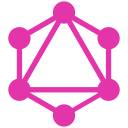

# Hi, I'm Ehtesham 👋

software engineer, se grad @ comsats lahore 
senior software engineer @ coordio - openbots 
prev swe @ netsol tech, tower technologies inc. 
interested in backend development, distributed systems, applied AI.

 

  
  
  
  
  
  
  
  
  
  
  
  
  
  
  
  
  
  
  
  
  
  
  
  
  
  
  
  
  
  
  
  
  
  
  
  

<picture>
  <source media="(prefers-color-scheme: dark)" srcset="https://raw.githubusercontent.com/ehteshamabad/ehteshamabad/output/pacman-contribution-graph-dark.svg">
  <source media="(prefers-color-scheme: light)" srcset="https://raw.githubusercontent.com/ehteshamabad/ehteshamabad/output/pacman-contribution-graph.svg">
  
</picture>
